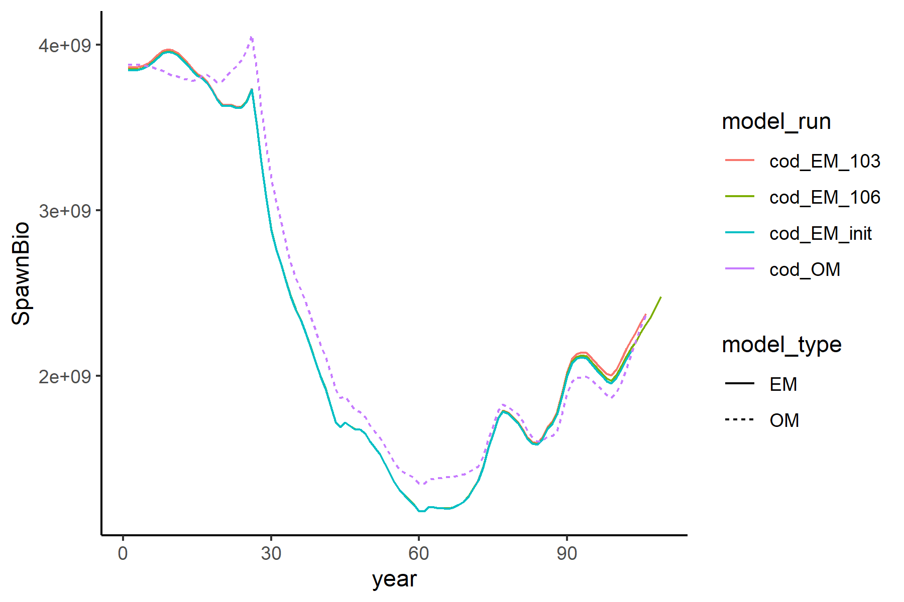

# README

# (SSMSE) Management Strategy Evaluation for Stock Synthesis (SS)

master:
[](https://travis-ci.org/nmfs-fish-tools/SSMSE)
[](https://ci.appveyor.com/project/nmfs-fish-tools/SSMSE)
[](https://codecov.io/gh/nmfs-fish-tools/SSMSE)


**************

https://nmfs-fish-tools.github.io/SSMSE/


**************

## This is a repository for the Stock Assessment Tool: SSMSE
- Supported by the NOAA Fisheries Integrated Toolbox


## Disclaimer

“The United States Department of Commerce (DOC) GitHub project code is provided on an ‘as is’ basis and the user assumes responsibility for its use. DOC has relinquished control of the information and no longer has responsibility to protect the integrity, confidentiality, or availability of the information. Any claims against the Department of Commerce stemming from the use of its GitHub project will be governed by all applicable Federal law. Any reference to specific commercial products, processes, or services by service mark, trademark, manufacturer, or otherwise, does not constitute or imply their endorsement, recommendation or favoring by the Department of Commerce. The Department of Commerce seal and logo, or the seal and logo of a DOC bureau, shall not be used in any manner to imply endorsement of any commercial product or activity by DOC or the United States Government.”

<!-- - This project code is made available through GitHub but is managed by NOAA at
 https://vlab.ncep.noaa.gov/redmine/projects/integrated-fisheries-toolbox/files -->

***** *******

Installing the SSMSE R package
---------

Note that the SSMSE is a work in progress and not yet a minimum viable product.

To install SSMSE from github and load it:
``` r
library(devtools) # note that library(remotes) can also be used. Both can access `install_github`. 
install_github("nmfs-fish-tools/SSMSE")
library(SSMSE)
```
You can read the help files with

``` r
?SSMSE
```

An SSMSE toy example
---------

This code runs 1 iteration of an MSE feedback loop. The code specifies the operating model (OM) as "cod", which is an example model included in the external data for the SSMSE package. Because this is a toy example and not a true MSE, the cod model is also used as the estimation model (EM) to get future catch. The MSE loop runs for 6 years, with a stock assessment occuring every 3 years. The cod model's last year is 100, so the OM is initially conditioned through year 100. Then, after conditioning the operating model through year 100, assessments will occur in years 100, 103, and 106. Note that the assessment run in year 106 will generate future catch for years 107, 108, and 109, but these are not feed back into the operating model because the MSE loop is specified to only run through year 106). The argument `sample_struct` specifies the data structure to add to the estimation model. In this case, we add catch every year from fleet to the estimation model and an index of abundance (CPUE) in years 102 and 105 for fleet 2. Because they are not specified, no length or age composition data is added. Note that no implementation error is assumed for forecasted catch and recruitment dviations into the future are all assumed to be 0.

```r
# Create a folder for the output in the working directory.
run_SSMSE_dir <- file.path("run_SSMSE-ex")
dir.create(run_SSMSE_dir)
# set up the data list to include for future runs of the EM
# only catch in all years, index data in years 102 and 105, no comp data.
sample_struct <- list(
                catch = data.frame(year = 101:106,
                                   seas = 1,
                                   fleet = 1),
                CPUE = data.frame(year = c(102, 105),
                                  seas = 7,
                                  index = 2)
              )
sample_struct_list <- list(sample_struct)

# run 1 iteration and 1 scenario of SSMSE using an EM.
run_SSMSE(scen_name_vec = "scen_1",
          iter_list = list(1),
          OM_name_vec = "cod", # cod is included in package data
          EM_name_vec = "cod", # cod is included in package data
          MS_vec = "EM",       # The management strategy is specified in the EM
          use_SS_boot_vec = TRUE, # use the SS bootstrap module for sampling
          nyrs_vec = 6,        # Years to project OM forward
          nyrs_assess_vec = 3, # Years between assessments
          rec_dev_pattern = "none", # Don't use recruitment deviations
          impl_error_pattern = "none", # Don't use implmentation error
          sample_struct_list = sample_struct_list) # How to sample data for running the EM.
```

The function `SSMSE_summary_iter` can be used to summarize the model results in a list of dataframes. Note that if you have issues, try reinstalling SSMSE using `remotes::install_github("nmfs-fish-tools/SSMSE")` and restarting your R session. Also, make sure you are using the development branch versions of [r4ss](https://github.com/r4ss/r4ss) and [ss3sim](https://github.com/ss3sim/ss3sim) (by installing `remotes::install_github("r4ss/r4ss@development")` and `remotes::install_github("ss3sim/ss3sim@development")`. These versions should be installed automatically when SSMSE is downloaded.

```r
# Summarize 1 iteration of output
# (note: if you have issues, try reinstalling SSMSE, as this is a new feature)
summary <- SSMSE_summary_iter(file.path(run_SSMSE_dir, "scen_1", "1"))
```
Plotting and data manipulation can then be done with these summaries. For example, SSB over time by model can be plotted. The models include the Operating Model (cod_OM), Estimation model (EM) for the historical period of years 0-100 (cod_EM_init), the EM run with last year of data in year 103 (cod_EM_103), and the EM run with last year of data in 106 (cod_EM_106).
```r
library(ggplot2) # use install.packages("ggplot2") to install package if needed
library(tidyr) # use install.packages("tidyr") to install package if needed
summary$timeseries <- tidyr::separate(summary$timeseries,
                               col = model_run,
                               into = c(NA, "model_type"),
                               remove = FALSE,
                               sep = "_", 
                               extra = "drop")
plot <- ggplot2::ggplot(data = summary$timeseries, aes(x = year, y = SpawnBio)) +
          geom_line(aes(color = model_run, linetype = model_type))+
          theme_classic()
print(plot)
```



If it is easier to view or manipulate the summaries in spreadsheets, these can be written to .csv:
```r
write.csv(summary[["scalar"]], 
          file = file.path(run_SSMSE_dir, "scen_1", "1", "scalar.csv"))
write.csv(summary[["timeseries"]],
          file = file.path(run_SSMSE_dir, "scen_1", "1", "timeseries.csv"))
write.csv(summary[["derived"]],
          file = file.path(run_SSMSE_dir, "scen_1", "1", "derived.csv"))
```

If you wish to delete the files created from this example, you can use:
```r
unlink(run_SSMSE_dir, recursive = TRUE)
```

Roadmap: Where is SSMSE headed next?
---------

SSMSE is still a work in progress, with basic framework in development. Some new directions we hope to work on shortly:

 - Add functions to summarize results from running MSE analyses
 - Add functions to calculate performance metrics
 - Add functions to make some basic plots of diagonstics and results

If you have thoughts about how to implement the upcoming work or are interested in helping develop SSMSE, please contact the developers by posting an issue in this repository or emailing nmfs.stock.synthesis@noaa.gov


