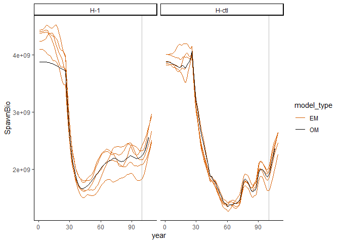
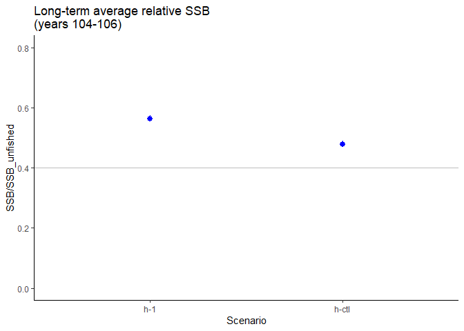

SSMSE: Management Strategy Evaluation for Stock Synthesis (SS)
================

  - [SSMSE build status](#ssmse-build-status)
  - [Motivation for developing SSMSE](#motivation-for-developing-ssmse)
  - [Installing the SSMSE R package](#installing-the-ssmse-r-package)
  - [Troubleshooting Installation](#troubleshooting-installation)
  - [An SSMSE example](#an-ssmse-example)
      - [Setup R workspace folders](#setup-r-workspace-folders)
      - [Create the operating models
        (OMs)](#create-the-operating-models-oms)
      - [Examine the management procedure
        used](#examine-the-management-procedure-used)
      - [Adding observation error: Specify how to sample data from the
        Operating
        model](#adding-observation-error-specify-how-to-sample-data-from-the-operating-model)
      - [Adding process error through recruitment
        deviations](#adding-process-error-through-recruitment-deviations)
      - [Run SSMSE](#run-ssmse)
      - [run\_SSMSE output](#run_ssmse-output)
      - [Performance metrics](#performance-metrics)
      - [Summarize results](#summarize-results)
      - [Example MSE Results](#example-mse-results)
      - [Delete the files](#delete-the-files)
  - [Advanced options: use a custom management
    strategy/procedure](#advanced-options-use-a-custom-management-strategyprocedure)
  - [How can I contribute to SSMSE?](#how-can-i-contribute-to-ssmse)
  - [Roadmap: Where is SSMSE headed
    next?](#roadmap-where-is-ssmse-headed-next)

<!-- README.md is generated from README.Rmd. Please edit README.Rmd -->


# SSMSE build status

master: [](https://travis-ci.org/nmfs-fish-tools/SSMSE)
[](https://ci.appveyor.com/project/nmfs-fish-tools/SSMSE)
[](https://codecov.io/gh/nmfs-fish-tools/SSMSE)

-----

<https://nmfs-fish-tools.github.io/SSMSE/>

-----

**This is a repository for the Stock Assessment Tool: SSMSE**

  - Supported by the NOAA Fisheries Integrated Toolbox

**Disclaimer**

“The United States Department of Commerce (DOC) GitHub project code is
provided on an ‘as is’ basis and the user assumes responsibility for its
use. DOC has relinquished control of the information and no longer has
responsibility to protect the integrity, confidentiality, or
availability of the information. Any claims against the Department of
Commerce stemming from the use of its GitHub project will be governed by
all applicable Federal law. Any reference to specific commercial
products, processes, or services by service mark, trademark,
manufacturer, or otherwise, does not constitute or imply their
endorsement, recommendation or favoring by the Department of Commerce.
The Department of Commerce seal and logo, or the seal and logo of a DOC
bureau, shall not be used in any manner to imply endorsement of any
commercial product or activity by DOC or the United States Government.”

<!-- - This project code is made available through GitHub but is managed by NOAA at https://vlab.ncep.noaa.gov/redmine/projects/integrated-fisheries-toolbox/files -->

-----

# Motivation for developing SSMSE

This package was developed to increase the ease of using SS directly as
an operating model in an Management Strategy evaluation. The approach
requires a conditioned Stock Synthesis model, which is treated as the
Operating Model and a Stock Synthesis model to use as the Estimation
Model (EM) and to specify the Management procedure through the Stock
Synthesis forecasting model. In the future, we plan to make the choice
of estimation method and management procedure more flexible.

Below, we’ll work through a simple example MSE as a way of introducing
the SSMSE package.

# Installing the SSMSE R package

Note that the SSMSE is a work in progress and not yet a minimum viable
product.

To install SSMSE from github:

``` r
remotes::install_github("nmfs-fish-tools/SSMSE")
```

You can read the help files with

``` r
?SSMSE
```

# Troubleshooting Installation

Here are some tips:

  - Make sure you are using the development branch versions of R
    packages `r4ss` and `ss3sim`. These can be installed separately
    using `remotes::install_github("r4ss/r4ss", ref = "development")`
    and `remotes::install_github("ss3sim/ss3sim", ref = "development")`.
  - If R asks “Would you like to download from sources that need
    compilation?”, select “no”, as the older compiled versions should
    work fine.
  - If R asks which packages you would like to update, select “none.”
    Although it is good to update to keep packages current, install can
    sometimes be frustrating when updating many packages and skipping
    this step can eliminate issues in the short term.
  - If running into an error during install, try closing out all R
    sessions open (e.g., other R GUI or R studio windows), restarting
    the R session and trying
    `remotes::install_github("nmfs-fish-tools/SSMSE")` again.
  - If still running into an error during install, and it seems to be a
    problem installing a particular package, try restarting the R
    session, using `install.packages()` to download the package that
    caused the error, restarting the R session, and trying
    `remotes::install_github("nmfs-fish-tools/SSMSE")` again. This step
    may need to be done several times for different R packages.

Still having trouble installing SSMSE? Please don’t hesitate to open an
[issue](https://github.com/nmfs-fish-tools/SSMSE/issues).

# An SSMSE example

Suppose we want to look at how well we are able to achieve a specified
management procedure under uncertainty in the operating model (OM). We
will look 2 scenarios, one where Steepness (h) is specified correctly
and one where it is specified incorrectly in an estimation model (EM):

Scenario 1. **h-ctl**: Cod operating model (h = 0.65) with correctly
specified cod model EM (fixed h = 0.65). The OM is the same as the EM.

Scenario 2. **h-1**: Cod operating model (h = 1) with misspecified cod
model EM (fixed h = 0.65); The OM is not the same as the EM.

Note that this is a simple example where the OM and EM structures for
both scenarios are identical, except for different steepness between the
OM and EM in scenario 2. We will assume we want to run the MSE loop for
6 years, with a stock assessment occuring every 3 years (and forecasting
catch to maintain 40% of unfished spawning stock biomass). The cod
model’s last year is 100, so the OM is initially conditioned through
year 100. Then, after conditioning the operating model through year 100,
assessments will occur in years 100 and 103. The operating model runs
through year 106. We chose not to run the assessment in year 106, as
there was no need for its output in this example.

## Setup R workspace folders

First, we will load the `SSMSE` package and create a folder in which to
run the example:

``` r
library(SSMSE) #load the package
library(r4ss) #install using remotes::install_github("r4ss/r4ss@development)
library(foreach) #if using run_parallel = TRUE
library(doParallel) #if using run_parallel = TRUE
## Loading required package: iterators
## Loading required package: parallel
```

``` r
# Create a folder for the output in the working directory.
run_SSMSE_dir <- file.path("run_SSMSE-ex")
dir.create(run_SSMSE_dir)
```

## Create the operating models (OMs)

The cod model with h = 0.65 (as in scenario 1) is included as external
package data in SSMSE. However, we will need to modify it to use as an
operating model with h = 1 (as in scenario 2). Note in this case that
refit\_OM is false, so the model is not being refit, just run through
without fitting. To condition the new model on the same data as the
input model, refit\_OM should be TRUE.

First, we identify where the base cod model is stored, modify it such
that the steepness parameter is 1, and save the modified cod OM for
scenario 2 in a new folder in the `run_SSMSE_dir` directory.

``` r
cod_mod_path <- system.file("extdata", "models", "cod", package = "SSMSE")
# develop_OMs will save a model called "cod_SR_BH_steep_1" in the out_dir
# specified
develop_OMs(OM_name = "cod", out_dir = run_SSMSE_dir, par_name = "SR_BH_steep",
            par_vals = 1, refit_OMs = FALSE, hess = FALSE)
# OM model for scenario 2
cod_1_path <- file.path(run_SSMSE_dir, "cod_SR_BH_steep_1")
```

## Examine the management procedure used

We will use the same management procedure for both scenarios:

1.  Conduct a stock assessment every 3 years to get stock status.
2.  Forecast from this stock assessment using the SS forecast file to
    get future catch.
3.  Put this forecasted catch (without implementation error, in the case
    of this example) back into the OM. Extend the OM forward in time to
    get the true values for the population.

Let’s take a look at step 2 in the management procedure, which is
implemented using the forecasting module in SS. We will examine the
forecast file for the estimation model to better understand how catches
will be forecasted from the assessment. We will use the same management
procedure in both of these scenarios, although for a full MSE analysis,
it is likely that multiple management procedures would be compared.

``` r
fore <- r4ss::SS_readforecast(
  system.file("extdata", "models", "cod", "forecast.ss", package = "SSMSE"),
  verbose = FALSE)
fore$Forecast 
## [1] 3
fore$Btarget
## [1] 0.4
```

`fore$Forecast = 3` means our forecasts from the assessment will use
fishing mortality (F) to achieve a relative (to unfished) spawning stock
biomass. Based on `fore$Btarget`, the relative biomass target is 40% of
unfished spawning stock biomass. Note also that the control rule
`fore$BforconstantF` and `fore$BfornoF` values are set low to make it
unlikely that they will be used (these parameters are used for a ramp
harvest control rule, which we do not want to use here):

``` r
fore$BforconstantF
## [1] 0.03
fore$BfornoF
## [1] 0.01
```

Futhermore, `fore$Flimitfraction` is set to 1 so that the forecasted
catch is set equal to the overfishing limit (for simplicity):

``` r
fore$Flimitfraction
## [1] 1
```

Note that the number of forecast years is 1:

``` r
fore$Nforecastyrs
## [1] 1
```

However, an assessment will be conducted every 3 years and 3 years of
forecasting is required. SSMSE will modify this value to the appropriate
number of forecasting years.

More information on using the forecast module in SS to forecast catches
is available in the [Stock Synthesis users
manual](https://vlab.ncep.noaa.gov/web/stock-synthesis/document-library/-/document_library/0LmuycloZeIt/view/4513132).

## Adding observation error: Specify how to sample data from the Operating model

The argument `sample_struct` specifies the structure for sampling from
the OM (and passing to the EM). The function `create_sample_struct` can
be used to construct a simple sampling structure consistent with an
input data file:

``` r
datfile <- system.file("extdata", "models", "cod", "ss3.dat", package = "SSMSE")
sample_struct <- create_sample_struct(dat = datfile, nyrs = 6) # note warning
## Warning in FUN(X[[i]], ...): Pattern not found for lencomp: FltSvy 1, Seas 1.
## Returning NA for Yr in this dataframe.
sample_struct
## $catch
##    Yr Seas FltSvy    SE
## 1 101    1      1 0.005
## 2 102    1      1 0.005
## 3 103    1      1 0.005
## 4 104    1      1 0.005
## 5 105    1      1 0.005
## 6 106    1      1 0.005
## 
## $CPUE
##    Yr Seas FltSvy  SE
## 1 105    7      2 0.2
## 
## $lencomp
##   Yr Seas FltSvy Sex Part Nsamp
## 1 NA    1      1   0    0   125
## 
## $agecomp
##    Yr Seas FltSvy Sex Part Ageerr Lbin_lo Lbin_hi Nsamp
## 1 105    1      2   0    0      1      -1      -1   500
```

By default, `create_sample_struct` identifies sampling patterns from the
historical period of the OM and replicates those patterns in the
projection period. In our cod example, the sample structure specifies
that catch will be added to the estimation model every year (years 101
to 106), but an index of abundance (i.e., CPUE) and age composition
(i.e., agecomp) will only be added in year 105. We will use the same
sampling scheme for both scenarios, but it is possible to specify
different sampling for each scenario. The user could modify this
sampling strategy (for example, maybe age composition should also be
sampled from FltSvy 2 in Yr 102; the user could add another line to the
dataframe in `sample_struct$agecomp`).

Note that length comp (lencomp) includes an `NA` value for year. This is
because no consistent pattern was identified, so the user must define
their own input. In this case, we will remove sampling length comps all
together:

``` r
sample_struct$lencomp <- NULL # don't use length sampling
```

The same sampling structure will be used for both scenarios, which we
define in a list below:

``` r
sample_struct_list <- list("h-ctl" = sample_struct, "h-1" = sample_struct)
```

## Adding process error through recruitment deviations

Process error can be added through the recruitment deviations. In this
case, `rec_dev_pattern = "rand"` in the call to `run_SSMSE` is used to
use random recruitment deviations with the same standard deviation as
the historical recruitment deviation pattern. Set `scope = 2` so that
the same recruitment deviation patterns are used across scenarios, but
different patterns are use across iterations in the same scenario. For
more information on the available options for `rec_dev_pattern` and
`scope` please see the documentation for the `run_SSMSE` function
(`?SSMSE::run_SSMSE`).

<!-- TODO suggestion from CP: might be nice to introduce the other recruitment deviations options and scope options here, too. I don't really understand what the scope means.   -->

## Run SSMSE

Now, we create a directory to store our results, and use `run_SSMSE` to
run the MSE analysis loop (note this will take some time to run, \~ 20
min):

``` r
run_res_path <- file.path(run_SSMSE_dir, "results")
dir.create(run_res_path)
run_SSMSE(scen_name_vec = c("h-ctl", "h-1"),# name of the scenario
          out_dir_scen_vec = run_res_path, # directory in which to run the scenario
          iter_vec = c(5,5), # run with 5 iterations each
          OM_name_vec = NULL, # specify directories instead
          OM_in_dir_vec = c(cod_mod_path, normalizePath(cod_1_path)), # OM files
          EM_name_vec = c("cod", "cod"), # cod is included in package data
          MS_vec = c("EM","EM"),       # The management strategy is specified in the EM
          use_SS_boot_vec = c(TRUE, TRUE), # use the SS bootstrap module for sampling
          nyrs_vec = c(6, 6),        # Years to project OM forward
          nyrs_assess_vec = c(3, 3), # Years between assessments
          rec_dev_pattern = "rand", # Use random recruitment devs
          scope = "2", # to use the same recruitment devs across scenarios.
          impl_error_pattern = "none", # Don't use implementation error
          run_EM_last_yr = FALSE, # Run the EM in 106
          run_parallel = TRUE, # Run iterations in parallel
          sample_struct_list = sample_struct_list, # How to sample data for running the EM.
          seed = 12345) #Set a fixed integer seed that allows replication 
```

See `?run_SSMSE` for more details on function arguments. In a real MSE
analysis, running 100+ iterations to reflect the full range of
uncertainty (given observation and process errors) in the results would
be preferred. However, we are only running 5 iterations per scenario in
this demonstration to reduce computing time.

## run\_SSMSE output

`run_SSMSE` will create new folders in the folders specified in
`out_dir_scen_vec` (note that in this case, we are running both
scenarios in the same folder). After is complete, there will be a folder
for each scenario in `run_res_path` (since `out_dir_scen_vec =
run_res_path` in this example):

``` r
list.dirs(run_res_path, recursive = FALSE)
## [1] "run_SSMSE-ex/results/h-1"   "run_SSMSE-ex/results/h-ctl"
```

Within each scenario is a folder for each scenario:

``` r
# See folders for scenario 1.
list.dirs(file.path(run_res_path, "h-ctl"), recursive = FALSE)
## [1] "run_SSMSE-ex/results/h-ctl/1" "run_SSMSE-ex/results/h-ctl/2"
## [3] "run_SSMSE-ex/results/h-ctl/3" "run_SSMSE-ex/results/h-ctl/4"
## [5] "run_SSMSE-ex/results/h-ctl/5"
```

And within each scenario folder, there are folders containing the SS
models that were run by `run_SSMSE`.

``` r
# see folders for the first iteration of scenario 1
list.dirs(file.path(run_res_path, "h-ctl", "1"), recursive = FALSE)
## [1] "run_SSMSE-ex/results/h-ctl/1/cod_EM_103" 
## [2] "run_SSMSE-ex/results/h-ctl/1/cod_EM_init"
## [3] "run_SSMSE-ex/results/h-ctl/1/cod_OM"
```

There should be 1 folder for the OM, which is run multiple times in this
same folder during the MSE analysis. There are multiple folders for the
EMs, as a new folder is created each time an assessment is done. The
first run is the folder with a name ending in `init`; then, each
assessment after is named for the updated end year of the model.

With many iterations, the number of files adds up; in the future, we
hope to add options to save less output.

## Performance metrics

Quantitative performance metrics should be specified before conducting
an MSE. Typically, a suite of performance metrics will be examined;
however, for simplicity in this example, we will only look at what the
achieved relative biomass was for the last 3 years of projection in the
MSE to determine how it compares to the intended management target of
40% of unfished Spawning Stock Biomass. Note that we are only running
our MSE projection for 6 years, but longer projections are typical in
MSE analyses.

## Summarize results

The function `SSMSE_summary_all` can be used to summarize the model
results in a list of 3 dataframes, one for scalar outputs (named
`scalar`), one for timeseries outputs (`ts`), one for derived quantities
(`dq`). This function also creates summary csv files in the folder where
the results are stored.

``` r
# Summarize 1 iteration of output
summary <- SSMSE_summary_all(run_res_path)
## Extracting results from 2 scenarios
## Starting h-1 with 5 iterations
## Starting h-ctl with 5 iterations
```

Plotting and data manipulation can then be done with these summaries.
For example, SSB over time by model can be plotted. The models include
the Operating Model (cod\_OM), Estimation model (EM) for the historical
period of years 0-100 (cod\_EM\_init), and the EM run with last year of
data in year 103 (cod\_EM\_103). The operating models are shown in blue
or black (depending on the scenario), and the estimation model runs are
shown in orange, and the scenarios are shown on different subplots:

``` r
library(ggplot2) # use install.packages("ggplot2") to install package if needed
library(tidyr) # use install.packages("tidyr") to install package if needed
library(dplyr) # use install.packages("dplyr") to install package if needed
## 
## Attaching package: 'dplyr'
## The following objects are masked from 'package:stats':
## 
##     filter, lag
## The following objects are masked from 'package:base':
## 
##     intersect, setdiff, setequal, union
```

``` r
# plot SSB by year and model run
ggplot2::ggplot(data = subset(summary$ts, model_run %in% c("cod_OM", "cod_SR_BH_steep_1_OM", "cod_EM_103")), 
                ggplot2::aes(x = year, y = SpawnBio)) +
  ggplot2::geom_vline(xintercept = 100, color = "gray") +
  ggplot2::geom_line(ggplot2::aes(linetype = as.character(iteration), color = model_run))+
  ggplot2::scale_color_manual(values = c("#D65F00", "black", "blue")) +
  ggplot2::scale_linetype_manual(values = rep("solid", 50)) +
  ggplot2::guides(linetype = FALSE) +
  ggplot2::facet_wrap(. ~ scenario) +
  ggplot2::theme_classic()
```

<!-- --> This plot shows that SSB
estimated does not match perfectly with the operating model. A similar
plot could be made for anu parameter of interest.

Now, we calculate and plot the performance metric.

``` r
# The get_rel_SSB_avg calculates the relative SSB in each year for each
# iteration of the operating model, then takes the average over the years from
# min_yr, to max_year. It uses the summary object as input to do these
# calculations.
get_rel_SSB_avg <- function(summary, min_yr, max_yr) {
  # Get just the result for the OMs and not for the EMs.
  OM_vals <- unique(summary$ts$model_run)
  OM_vals <- grep("_OM$", OM_vals, value = TRUE)
  # find the unfished biomass fr the OMs
  B_unfished <- summary$scalar %>% 
    filter(model_run %in% OM_vals) %>% 
    select(iteration, scenario,SSB_Unfished)
  #  find the spawning stock biomass for the years of interest
  SSB_yr <- summary$ts %>% 
    filter(year >= min_yr & year <= max_yr) %>% 
    select(iteration, scenario, year, SpawnBio)
  # Calculated the relative spawning stock biomass using B_unfished and SSB_yr
  # dataframes, then take an average over years.
  SSB_yr <- left_join(SSB_yr, B_unfished) %>% 
    mutate(Rel_SSB = SpawnBio/SSB_Unfished) %>% 
    group_by(iteration, scenario) %>% 
    summarize(avg_SSB = mean(Rel_SSB), .groups = "keep") %>% 
    ungroup()
  SSB_yr # return SSB averaged over yrs for each iteration and each scenario.
}
rel_SSB <- get_rel_SSB_avg(summary, min_yr = 104, max_yr = 106)
## Joining, by = c("iteration", "scenario")

# function to summarize data in plot
data_summary <- function(x) {
  m <- mean(x)
  ymin <- m - sd(x)
  ymax <- m + sd(x)
  return(c(y = m, ymin = ymin, ymax = ymax))
}
# Now, plot the average relative spawning stock biomass for years 104 - 106
ggplot(data = rel_SSB, aes(x = scenario, y = avg_SSB)) +
  geom_hline(yintercept = 0.4, color = "gray") +
  stat_summary(fun.data = data_summary, 
               position = position_dodge(width = 0.9), color = "blue") +
  scale_y_continuous(limits = c(0, 0.8)) +
  labs(title = "Long-term average relative SSB\n(years 104-106)", 
       x = "Scenario", y = "SSB/SSB_unfished") +
  theme_classic()
```

<!-- -->

From the above plot, we see that the realized Spawning stock Biomass is
higher than the target that was intended for both scenarios.

## Example MSE Results

We can see from the performance metric that mis-specifying the value of
steepness will results in higher realized relative spawning stock
biomass than correctly specifying it. This gives us some idea of the
consequences of misspecifying steepness in the stock assessment.

## Delete the files

If you wish to delete the files created from this example, you can use:

``` r
unlink(run_SSMSE_dir, recursive = TRUE)
```

# Advanced options: use a custom management strategy/procedure

Users can outline a custom managment strategy as an R function to use.
As long as the correct inputs and outputs are used, any estimation
method and management procedure can be used. For example, here is a
simple function that just sets future catches as half the sampled
catches in a specified year:

``` r
constant_catch_MS <<- function(OM_dat, nyrs_assess, catch_yr = 100, 
                              frac_catch = 0.5, ...) { # need to include ... to allow function to work
  # set catch the same as the previous year (sampled catch).
  # catch is in the same units as the operating model, in this case it is in
  # biomass.
  catch <- data.frame(
    year = (OM_dat$endyr + 1):(OM_dat$endyr + nyrs_assess), # the years to project the model forward
    seas = 1, # hard coded from looking at model 
    fleet = 1,  # hard coded from looking at model
    catch = OM_dat$catch[OM_dat$catch$year == catch_yr, "catch"]*frac_catch,
    catch_se = 0.05) # hard coded from looking at model
  catch_bio <- catch # catch in biomass. In this case, catch is in biomass for both. Could also be left as NULL
  catch_F <- NULL # catch in terms of F, can be left as NULL.
  discards <- NULL # discards can be left as NULL if there are no discards
  catch_list <- list(catch = catch,
                     catch_bio = catch_bio, 
                     catch_F = catch_F,
                     discards = discards)
}
```

This function can then be used in a call to `run_SSMSE`:

``` r
run_result_custom <- run_SSMSE(scen_name_vec = "constant-catch", # name of the scenario
                out_dir_scen_vec = run_res_path, # directory in which to run the scenario
                iter_vec = 1,
                OM_name_vec = "cod", # specify directories instead
                OM_in_dir_vec = NULL,
                MS_vec = "constant_catch_MS", # use the custom function
                use_SS_boot_vec = TRUE, # use the SS bootstrap module for sampling, the only option
                nyrs_vec = 6,        # Years to project OM forward
                nyrs_assess_vec = 3, # Years between assessments
                rec_dev_pattern = "rand", # Use random recruitment devs
                scope = "2", # to use the same recruitment devs across scenarios, but not iterations
                impl_error_pattern = "none", # Don't use implementation error
                run_EM_last_yr = FALSE, # Don't run the EM in the last year
                run_parallel = FALSE, # Run iterations in parallel
                sample_struct_list = list(sample_struct_list[[1]]), # How to sample data for running the MS.
                seed = 12345) #Set a fixed integer seed that allows replication 
## Starting iteration 1.
## Finished running and sampling OM for the historical period for iteration 1.
## Finished getting catch (years 101 to 103) to feed into OM for iteration 1.
## Finished running and sampling OM through year 103.
## Finished getting catch (years 104 to 106) to feed into OM for iteration 1.
## Finished running and sampling OM through year 106.
## Finished iteration 1.
## Completed all iterations for scenario constant-catch
## Completed all SSMSE scenarios
```

# How can I contribute to SSMSE?

If you have thoughts about how to implement the [upcoming
work](#roadmap-where-is-ssmse-headed-next) or are interested in helping
develop SSMSE, please contact the developers by posting an issue in this
repository or emailing <nmfs.stock.synthesis@noaa.gov>.

If you are interested in contributing, please read the [NMFS Fisheries
Toolbox R Contribution
Guide](https://github.com/nmfs-fish-tools/Resources/blob/master/CONTRIBUTING.md).
This project and everyone participating in it is governed by the [NMFS
Fisheries Toolbox Code of
Conduct](https://github.com/nmfs-fish-tools/Resources/blob/master/CODE_OF_CONDUCT.md).
By participating, you are expected to uphold this code. Please report
unacceptable behavior to <fisheries.toolbox@noaa.gov>.

# Roadmap: Where is SSMSE headed next?

SSMSE is still a work in progress, with basic framework in development.
Some new directions we hope to work on shortly:

  - Adding more complex sampling options
  - Adding functions to calculate performance metrics
  - Adding functions to make some basic plots of diagonstics and results
  - Adding more management procedure options.

If you have thoughts about how to implement the upcoming work or are
interested in helping develop SSMSE, please contact the developers by
posting an issue in this repository or emailing
<nmfs.stock.synthesis@noaa.gov>
